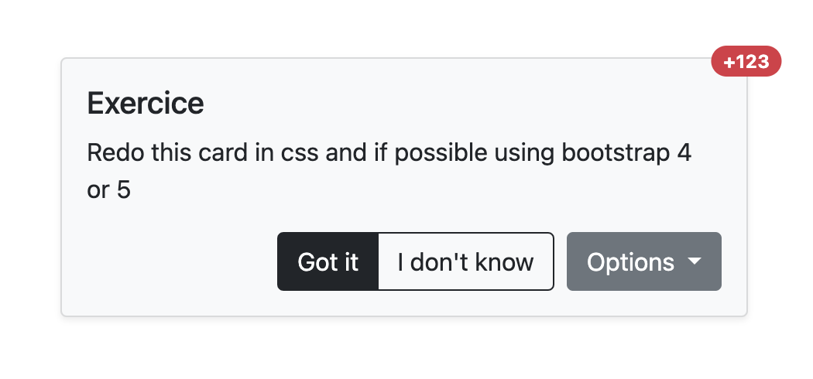

```javascript
//Find in this document my answers to the technical assessment and the explanation to each question, except from the CSS / Bootstrap question and the simple MongoDB queries, below the response, being commented out. 
```


# NodeJs

## Exercice: Is there a problem? _(1 points)_

```javascript
// Call web service and return count user, (got is library to call url)
async function getCountUsers() {
  return { total: await got.get('https://my-webservice.moveecar.com/users/count') };
}

// Add total from service with 20
async function computeResult() {
  const result = await getCountUsers();
  return result.total + 20;
}


//Explanation: Because getCountUsers is a promise, we need the asynchrony to obtain the value of the object in this case, Total.
```

## Exercice: Is there a problem? _(2 points)_

```javascript
// Call web service and return total vehicles, (got is library to call url)
async function getTotalVehicles() {
    return await got.get('https://my-webservice.moveecar.com/vehicles/total');
}

function getPlurial() {
    let total;
    getTotalVehicles().then((r) => {
      total = r

       if (total <= 0) {
          return 'none';
       }

       if (total <= 10) {
          return 'few';
       }

         return 'many';
    } );
   
}

//Explanation: The solution is to place the iterations of the 'if' inside the 'then' block and return the results. Previously, these were outside, and when executing 'getTotalVehicles', the code would stop without returning anything.
```

## Exercice: Unit test _(2 points)_

Write unit tests in jest for the function below in typescript

```typescript
import { expect, test } from '@jest/globals';

function getCapitalizeFirstWord(name: string): string {
  if (name == null) {
    throw new Error('Failed to capitalize first word with null');
  }
  if (!name) {
    return name;
  }
  return name.split(' ').map(
    n => n.length > 1 ? (n.substring(0, 1).toUpperCase() + n.substring(1).toLowerCase()) : n
  ).join(' ');
}

test('1. test', async function () {
   it('should capitalize the first letter of each word and convert the rest to lowercase', () => {
      // Arrange
      const name = 'hello world';

      // Act
      const result = getCapitalizeFirstWord(name);

      // Assert
      expect(result).toBe('Hello World');
    });
});

//Explanation: For this test, we declare a constant with a lowercase string, then proceed to call the function getCapitalizeFirstWord where the argument will be the constant 'name'. We use 'expect' to await that the return of the getCapitalizeFirstWord function will be toBe('Hello World').
```

# Angular

## Exercice: Is there a problem and improve the code _(5 points)_

```typescript
@Component({
  selector: 'app-users',
  template: `
    <input type="text" [(ngModel)]="query" (ngModelChange)="querySubject.next($event)">
    <div *ngFor="let user of users">
        {{ user.email }}
    </div>
  `
})
export class AppUsers implements OnInit {

  query = '';
  querySubject = new Subject<string>();

  users: { email: string; }[] = [];

  constructor(
    private userService: UserService
  ) {
  }

  ngOnInit(): void {
    concat(
      of(this.query),
      this.querySubject.asObservable()
    ).pipe(
      concatMap(q =>
        timer(0, 60000).pipe(
          this.userService.findUsers(q)
        )
      )
    ).subscribe({
      next: (res) => this.users = res
    });
  }
}

//Explanation: I didn't really know how to tackle this one. I am keen to learn the right answer and implement the findings on future tasks.

```


## Exercice: Improve performance _(5 points)_

```typescript
@Component({
  selector: 'app-users',
  template: `
    <div *ngFor="let user of users">
        {{ getCapitalizeFirstWord(user.name) }}
    </div>
  `
})
export class AppUsers {

  @Input()
  users: { name: string; }[];

  constructor() {}
  
  getCapitalizeFirstWord(name: string): string {
    return  name.charAt(0).toUpperCase() + name.slice(1);
  }
}

//Explanation: To improve the code, we removed line 147 and replaced it with name.charAt(0).toUpperCase() + name.slice(1), which yields the same result with less code.
```

## Exercice: Forms _(8 points)_

Complete and modify `AppUserForm` class to use Angular Reactive Forms. Add a button to submit.

The form should return data in this format

```typescript
{
  email: string; // mandatory, must be a email
  name: string; // mandatory, max 128 characters
  birthday?: Date; // Not mandatory, must be less than today
  address: { // mandatory
    zip: number; // mandatory
    city: string; // mandatory, must contains only alpha uppercase and lower and space
  };
}
```

```typescript
import { Component, EventEmitter, OnInit, Output } from '@angular/core';
import { FormBuilder, FormGroup, Validators } from '@angular/forms';

@Component({
  selector: 'app-user-form',
  template: `
    <form [formGroup]="form" (ngSubmit)="doSubmit()">
      <input type="text" placeholder="email" id="email" formControlName="email" />
      <input type="text" placeholder="name" id="name" formControlName="name" />
      <input type="date" placeholder="birthday" id="birthday" formControlName="birthday"/>
      <input type="number" placeholder="zip" id="zip" formControlName="zip" />
      <input type="text" placeholder="city" id="city" formControlName="city" />
      <button type="submit" [disabled]="form.invalid">Send</button>
    </form>
  `
})
export class AppUserForm implements OnInit{
form!: FormGroup;
  @Output()
  event = new EventEmitter<{
    email: string;
    name: string;
    birthday: Date;
    address: { zip: number; city: string };
  }>();

  constructor(private formBuilder: FormBuilder) {}

  ngOnInit(): void {
    this.form = this.formBuilder.group({
      email: ['', [Validators.required, Validators.email]],
      name: [
        '',
        [
          Validators.required,
          Validators.minLength(2),
          Validators.maxLength(128),
        ],
      ],
      birthday: [''],
      zip: ['', [Validators.required]],
      city: ['', [Validators.required, Validators.pattern(/^[a-zA-Z]+$/)]],
    });
  }

  doSubmit(): void {
    this.event.emit({
      email: this.form.value.email,
      name: this.form.value.name,
      birthday: this.form.value.birthday,
      address: {
        zip: this.form.value.zip,
        city: this.form.value.city,
      },
    });
  }
}

//Explanation: Here we have a reactive form with its respective validations, sing the Validators operator from Angular/forms. We implemented a submit type button that will be enabled when the inputs are valid.
```


# CSS & Bootstrap

## Exercice: Card _(5 points)_



```typescript


 <div class="card position-relative" style="width: 26rem">
      <span
        class="position-absolute top-0 start-100 translate-middle badge rounded-pill bg-danger"
      >
        +123
        <span class="visually-hidden">unread messages</span>
      </span>
      <div class="card-body">
        <h5 class="card-title">Exercise</h5>
        <p class="card-text">
          Redo this card in css and if possible using boostrap 4 or 5
        </p>

        <div class="d-flex justify-content-end">
          <div
            class="btn-group"
            role="group"
            aria-label="Basic outlined example"
          >
            <button
              type="button"
              class="btn"
              style="color: white; background-color: black; font-weight: 500"
            >
              Got it
            </button>
            <button
              type="button"
              class="btn"
              style="color: black; border: 1px solid black; font-weight: 500"
            >
              I don't know
            </button>
            <!-- <button type="button" class="btn btn-outline-primary">Right</button> -->
          </div>

          <div class="dropdown" style="margin-left: 10px">
            <button
              class="btn btn-secondary dropdown-toggle"
              type="button"
              data-bs-toggle="dropdown"
              aria-expanded="false"
            >
              Options
            </button>
            <ul class="dropdown-menu">
              <li><a class="dropdown-item" href="#">Action</a></li>
              <li><a class="dropdown-item" href="#">Another action</a></li>
              <li><a class="dropdown-item" href="#">Something else here</a></li>
            </ul>
          </div>
        </div>
      </div>
    </div>
    

# MongoDb

## Exercice: MongoDb request _(3 points)_

MongoDb collection `users` with schema

``` typescript
  {
    email: string;
    first_name: string;
    last_name: string;
    roles: string[];
    last_connection_date: Date;
  }
```

Complete the query, you have a variable that contains a piece of text to search for. Search by exact email, starts with first or last name and only users logged in for 6 months

``` typescript


let searchText = 'your_search_text';
let sixMonthsAgo = new Date();
sixMonthsAgo.setMonth(sixMonthsAgo.getMonth() - 6);

db.collection('users').find({
  $or: [
    { email: searchText },
    { first_name: { $regex: ^${searchText}, $options: 'i' } },
    { last_name: { $regex: ^${searchText}, $options: 'i' } }
  ],
  last_connection_date: { $gte: sixMonthsAgo }
});

//Explanation: The query remains like this to retrieve exact search by email, name, and last name. 


```

What should be added to the collection so that the query is not slow?

``` typescript

db.collection('users').createIndex({ email: 1, first_name: 1, last_name: 1, last_connection_date: 1 });

//Explanation: If we want the database to be faster, we should create an index.


## Exercice: MongoDb aggregate _(5 points)_

MongoDb collection `users` with schema

``` typescript
  {
    email: string;
    first_name: string;
    last_name: string;
    roles: string[];
    last_connection_date: Date;
  }
```

Complete the aggregation so that it sends user emails by role ({_id: 'role', users: [email,...]})

``` typescript
db.collection('users').aggregate([
    { $unwind: "$roles" },
    {
      $group: {
        _id: "$roles",
        users: { $push: "$email" }
      }
    }
  ]);


//Explanation: The query for sending a message depending on the user's role is used in this way, with a $group.

```

## Exercice: MongoDb update _(5 points)_

MongoDb collection `users` with schema

``` typescript
  {
    email: string;
    first_name: string;
    last_name: string;
    roles: string[];
    last_connection_date: Date;
    addresses: {
        zip: number;
        city: string;
    }[]:
  }
```

Update document `ObjectId("5cd96d3ed5d3e20029627d4a")`, modify only `last_connection_date` with current date

``` typescript
  // Update last_connection_date with current date
db.collection('users').updateOne(
    { _id: ObjectId("5cd96d3ed5d3e20029627d4a") },
    { $set: { last_connection_date: new Date() } }
  );

//Explanation: 
```

Update document `ObjectId("5cd96d3ed5d3e20029627d4a")`, add a role `admin`

``` typescript
  // Add a role 'admin'
  db.collection('users').updateOne(
    { _id: ObjectId("5cd96d3ed5d3e20029627d4a") },
    { $push: { roles: 'admin' } }
  );
  
//Explanation: with the update operator $push we add the new role admin, assuming that there is a field of roles already defined. If that wouldn't be the case and we had to create it on the spot, we can do it using the update operator $addToSet instead.
```

Update document `ObjectId("5cd96d3ed5d3e20029627d4a")`, modify addresses with zip `75001` and replace city with `Paris 1`

``` typescript
 // Modify addresses with zip 75001 and replace city with 'Paris 1'
  db.collection('users').updateOne(
    { _id: ObjectId("5cd96d3ed5d3e20029627d4a"), "addresses.zip": 75001 },
    { $set: { "addresses.$.city": 'Paris 1' } }
  );

```